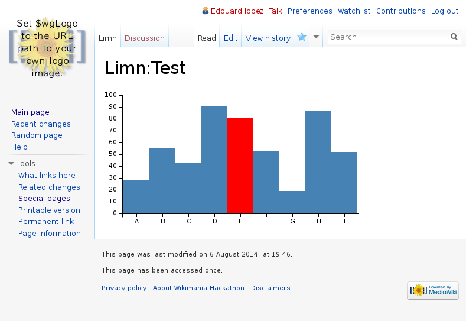

MediaWiki Limn
==============

`Limn` is a MediaWiki extension that uses [`Vega JS`](https://github.com/trifacta/vega) to visualize almost arbitrary data in almost arbitrary ways.

## Requirements

* [JsonConfig extension](https://www.mediawiki.org/wiki/Extension:JsonConfig) `≥1.24`.

## Installation

If you already have installed `mediawiki` and `JsonConfig` extension, just add the lines below to your _LocalSettings.php_. Otherwise follow the [installation instructions](https://www.mediawiki.org/wiki/Manual:Installing_MediaWiki).

```
require_once("$IP/extensions/JsonConfig/JsonConfig.php");
require_once("$IP/extensions/Limn/Limn.php");
```

Then check it's active in [Special:Version](http://wiki.example.com/index.php/Special:Version).

# Configuration

```
// To use limn as a tag element in wiki markup, 
// 	<limn>{...}</limn>
// enable it with:
$wgEnableLimnParserTag = true;

// To use it on a standalone page, enable it via $wgJsonConfigs
// https://www.mediawiki.org/wiki/Extension:JsonConfig
$wgJsonConfigModels['limn.jsonconfig'] = 'limn\Content';
$wgJsonConfigs['limn.jsonconfig'] = array(
	'namespace' => <PICK-A-NS-NUMBER>,
	'nsName' => 'Limn',
	'isLocal' => true,
);
```

# Usage

Create a new [page in the `Limn` namespace](http://wiki.example.com/index.php/Limn:TestPage) and paste the following (nothing else) save… and voilà!


```json
{
  "width": 400,
  "height": 200,
  "padding": {"top": 10, "left": 30, "bottom": 20, "right": 10},
  "data": [
    {
      "name": "table",
      "values": [
        {"x":"A", "y":28}, {"x":"B", "y":55}, {"x":"C", "y":43},
        {"x":"D", "y":91}, {"x":"E", "y":81}, {"x":"F", "y":53},
        {"x":"G", "y":19}, {"x":"H", "y":87}, {"x":"I", "y":52}
      ]
    }
  ],
  "scales": [
    {"name":"x", "type":"ordinal", "range":"width", "domain":{"data":"table", "field":"data.x"}},
    {"name":"y", "range":"height", "nice":true, "domain":{"data":"table", "field":"data.y"}}
  ],
  "axes": [
    {"type":"x", "scale":"x"},
    {"type":"y", "scale":"y"}
  ],
  "marks": [
    {
      "type": "rect",
      "from": {"data":"table"},
      "properties": {
        "enter": {
          "x": {"scale":"x", "field":"data.x"},
          "width": {"scale":"x", "band":true, "offset":-1},
          "y": {"scale":"y", "field":"data.y"},
          "y2": {"scale":"y", "value":0}
        },
        "update": { "fill": {"value":"steelblue"} },
        "hover": { "fill": {"value":"red"} }
      }
    }
  ]
}
```

Should result in:



## History 

* Zurich Hackathon, project started ;
* London Wikimania/Hackathon: continue.
